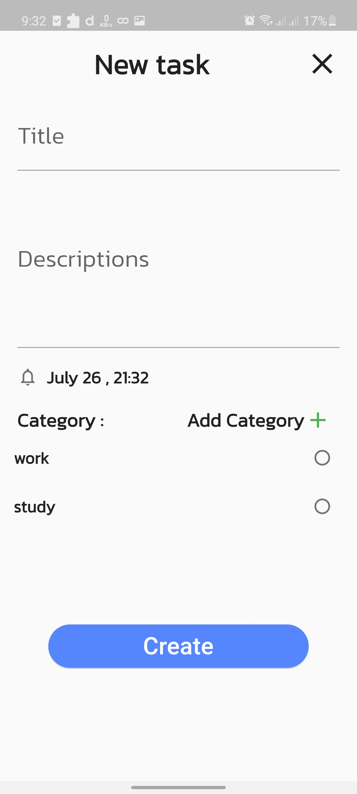

# Task_Manager

**This is another flutter project**.

**Flutter project package:**
    
**Dio,Eqatable,Riverpod,Flutter hook,shared_preferences,go_router**

**AND CHECK MY SERVER FOLDER FOR BACKEND CODE OF NODE JS,EXPRESS JS**

## Getting Started

   

    

 

