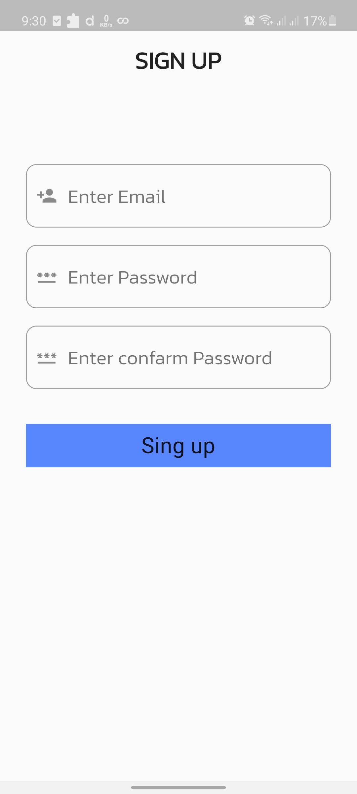
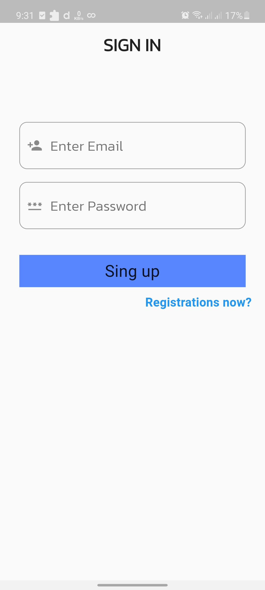
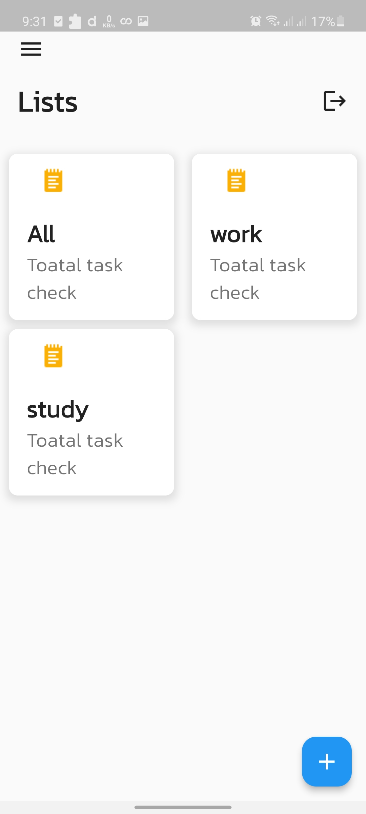
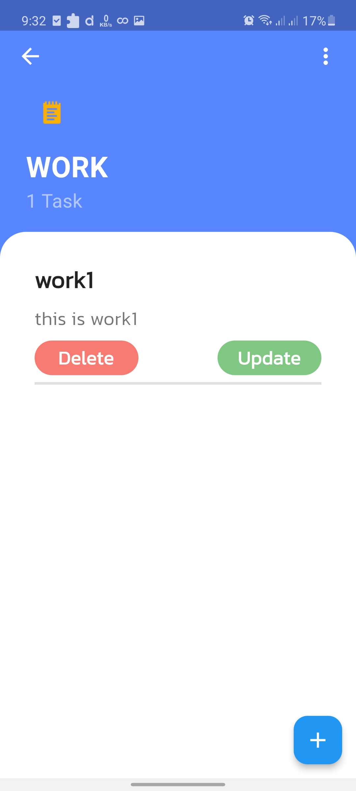
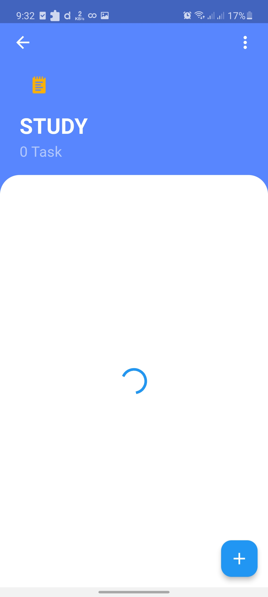
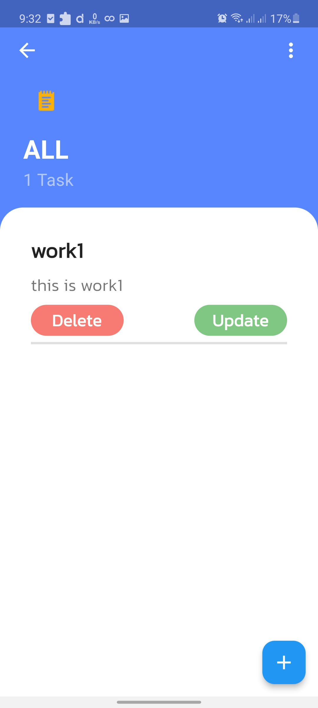

<!-- PROJECT LOGO -->
 

  <!--  -->

## **Task Manager**
  

    Task Manager is a android app that help to note your task and easily help to compelete your task 
     
    

  
      

    <a href="https://github.com/RootHex200/Fullstack-taskmanager/issues">Report Bug</a>
    ·
    <a href="https://github.com/RootHex200/Fullstack-taskmanager/issues">Request Feature</a>
  

<!-- TABLE OF CONTENTS -->

  
Table of Contents

  <ol>
    <li>
      <a href="#about-the-project">About The Project</a>
      <ul>
        <li><a href="#features-with-snapshots">Features with Snapshots</a></li>
        <li><a href="#built-with">Built With</a></li>
      </ul>
    <li><a href="#roadmap">Roadmap</a></li>
   
  </ol>

<!-- ABOUT THE PROJECT -->
## About The Project

 
Task Manager is android version app that save task and help to complete work easily.The app was made with Flutter as a Frontend Technology and Node js as a Backend Technology.This app help those people who complete daily or weekly task step by step.

(<a href="#top">back to top</a>)

## Features with Snapshots
1. User Login and Registers.
   

snapshot

   
     

   

2. Get home page with and see ALL task category
   

snapshot

     
   

3. Get category base Task 
   

snapshot

     

   

4. Get all category  task in All page option
   

snapshot

   

   

## Built With 
#### Frontend Technology  
* [Flutter](https://flutter.dev/?gclsrc=ds&gclsrc=ds)  
Features and Plugins I've used: 
   - Dio
   - Domain driven design
   - Eqatable
   - Riverpod
   - Flutter hook
   
* Demo video link: https://drive.google.com/file/d/10RutDfoxPI5QpkkB2lZAibDk4fFwOJJO/view?usp=sharing
#### Backend Technology  
* [Node js](https://nodejs.org/en/) 
* [Express js](https://expressjs.com/)

(<a href="#top">back to top</a>)

## Prerequisites
There are some prerequisites to run this app and server

* **NPM**
  
  Follow the instruction to install [node-js & npm](https://nodejs.org/de/download/package-manager/)
######
* **Flutter**

  Flutter has a greate [documentation](https://docs.flutter.dev/get-started/install) for enviroment setup 

## Roadmap
#### Frontend
- [x] Create five screen. 
  - [x] first 2 screen for Sign in and sign up 
  - [x] 3rd screen for category option.
  - [x] 4th screen for show category base data
  - [x] 5th screen for save data
- [x] Take infromation for sign in and sign up and send it to server when wiil be pressed sign in and sign up button.
- [x] create gridview builder in home page then  get data from server for show categroy option when click categroy option then get data from server for show categroy base task.when click "ALL" categroy option then get data from server to show All task 
- [x] crete floationaction bar when pressed floationaction bar for added new task then take information and send it to server
- [x] when click delete and update button then send task id and new info of update value in server
- [x] when click add category name in added task page  take name and send it to server
- [x] When click logout option then clear shared_preferences data
#### Backend
- [x] Create a Request Session.
- [x] send `POST` request for sign in and sign up(create new user as a uniqe email)
- [x] send `GET` request for get all task
- [x] send `DELETE` request for delete task 
- [x] send `PATCH` request for upate task data
- [x] send  `GET` request for get category name
- [x] send `POST` request for add category name
- [x] send `POST` request for add new task

(<a href="#top">back to top</a>)

